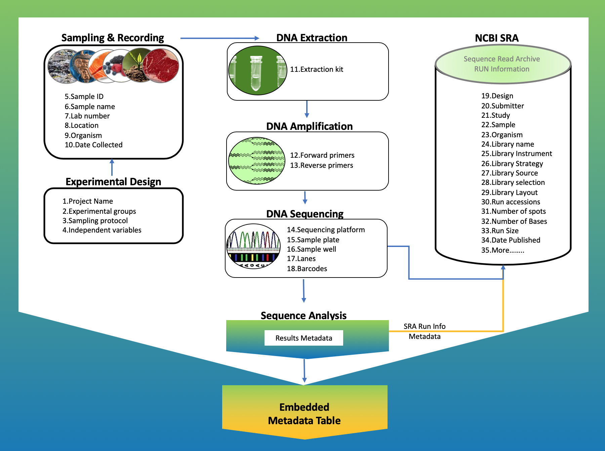

<h4>Github Repo: `r rmarkdown::metadata$github_repo`. </h4> 

<br>

<link rel="preconnect" href="https://fonts.googleapis.com">
<link rel="preconnect" href="https://fonts.gstatic.com" crossorigin>
<link href="https://fonts.googleapis.com/css2?family=Montserrat&display=swap" rel="stylesheet">
<link rel="preconnect" href="https://fonts.googleapis.com/css2?family=Anton&display=swap" rel="stylesheet">

```{r echo=FALSE, message=FALSE, warning=FALSE}
knitr::opts_chunk$set(
  echo = FALSE,
  message = FALSE,
  warning = FALSE,
  cache = FALSE,
  comment = NA,
  fig.path='./figures/',
  fig.show='asis',
  dev = 'png',
  fig.align='center',
  out.width = "70%",
  fig.width = 7,
  fig.asp = 0.7,
  fig.show = "asis"
)

library(tidyverse, suppressPackageStartupMessages())
library(schtools)

```

# General Overview

- We use the snakemake workflow management system [@Koster2021; @Snakemake2023] for:
  - Maintaining reproducibility in technical validation and regeneration of results
  - Creating scalable data analysis scaled to server, grid or cloud environment seamlessly.
  - Fostering sustainable improvement of the microbiome data analysis.
- Reviewing existing workflows methodlogies [@Snakemake2023; @Mothursnakemake] helps in gaining a better insights for improving microbiome data analysis.
- We break any complex workflows into small contiguous but related chunks for simplicity reasons.
- Each major step forms a separate executable snakemake rule and is represented in the DAG (Directed Acyclic Graph).

<br>

> We envision to keep fostering on continuous integration and development of highly reproducible workflows.


<br><hr width=50%><br>

# Basic requirements


<br><br>

## Snakemake rule DAG

<br><br>

## Screenshot of interactive snakemake report {#smkreport}
> Open the snakemake html report using a compartible browser such as chrome to explore more on the workflow and the associated statistics. You will be able to close the left bar to get a better view of the dispaly.


<br><hr width=50%><br>

# Basic Software
```{r child='workflow/scripts/software.Rmd'}
```

<br><hr width=50%><br>

# Sample Metadata Exploration & Profiling


```{r child='workflow/scripts/metadata.Rmd'}
```

<br><br>

## Read count distribution


<br>

### Read ascending size
```{r}
read_csv("results/read_size_asce.csv", show_col_types = FALSE) %>%
head()
```

<br><br>


### Read descending size
```{r}
read_csv("results/read_size_desc.csv", show_col_types = FALSE) %>%
head()
```

<br><br>

## Collection points on map
> Does the metadata contains latitudes and longitudes of the collection point? consider dropping a pin on exact location.


<br><hr width=50%><br><br>

# Appendix
<br><br>

## Project directories {#dirs}
```{bash}
cat images/project_tree.txt
```

<br><br>

## Troubleshooting (in progress)
<ol>
  <li>CiteprocXMLError: Missing root element</li>
    <ul>
      <li>Maybe the CSL file is empty. Some examples of citation style language are available on Github [@CSL2023].</li>
    </ul>
</ol>


<br><hr width=50%><br><br>

## References
::: {#refs}
:::

<br><br><hr width=50%><br>

<div id="footer">
Last updated on `r format(Sys.time(), '%B %d, %Y')`. <br><br>
The snakemake workflow mentioned in this report is continuously being reviewed, integrated, tested and compiled by [`r rmarkdown::metadata$author`](mailto:`r rmarkdown::metadata$email_address`).  
Github_Repo: `r rmarkdown::metadata$github_repo`.  

</div><br><br>
