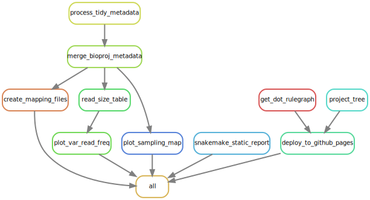
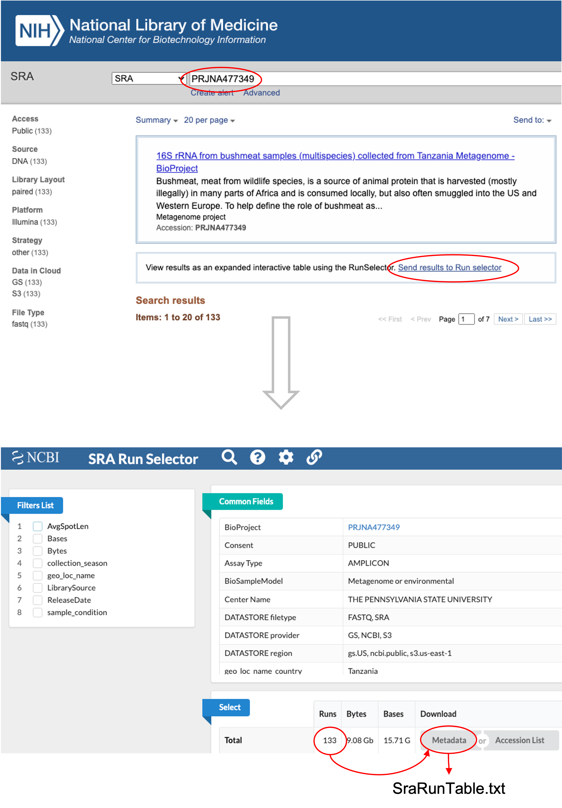

<div id="main-container">

<!-- Google Fonts: https://fonts.google.com/?preview.text=IMAP%20template&preview.text_type=custom-->
<link rel="preconnect" href="https://fonts.googleapis.com">
<link rel="preconnect" href="https://fonts.gstatic.com" crossorigin>
<link href="https://fonts.googleapis.com/css2?family=Anton" rel="stylesheet">
<link href="https://fonts.googleapis.com/css2?family=Roboto:wght@100;300;400;500;700,900&display=swap" rel="stylesheet">
<link href="https://fonts.googleapis.com/css2?family=Oswald:wght@300;400;700&display=swap" rel="stylesheet">
<link href="https://fonts.googleapis.com/css2?family=Merriweather:wght@300;400;700&display=swap" rel="stylesheet">
<link href="https://fonts.googleapis.com/css2?family=Montserrat:wght@100;200;300;400;700&display=swap" rel="stylesheet">

<span class="fas fa-my-custom-icon"></span>


```{r echo=FALSE, message=FALSE, warning=FALSE}
knitr::opts_chunk$set(
  echo = FALSE,
  message = FALSE,
  warning = FALSE,
  cache = FALSE,
  comment = NA,
  fig.path='./figures/',
  fig.show='asis',
  dev = 'png',
  fig.align='center',
  out.width = "70%",
  fig.width = 7,
  fig.asp = 0.7,
  fig.show = "asis"
)

library(tidyverse, suppressPackageStartupMessages())
library(schtools)
```

<br>

# Project Overview

## Current project tree
```{bash tree, include=FALSE}
bash workflow/scripts/tree.sh
```

```{bash treeimg}
cat images/project_tree.txt
```

<br><br>

##  Current snakemake workflow
```{bash ruledag, include=FALSE}
bash workflow/scripts/rules_dag.sh
```



<br><hr width=100%><br>

# General overview

## What is metadata?
- <b>Metadata</b> is a set of data that describes and provides information about other data. It is commonly defined as **data about data**.
- **Sample metadata** described in this book refers to the description and context of the individual sample collected for a specific microbiome study.

<br>

## Metadata structure
- Metadata collected at different stages are typically organized in an Excel or Google spreadsheet where:
  - The metadata table columns represent the properties of the samples.
  - The table rows contain information associated with the samples.
  - Typically, the first column of sample metadata is Sample ID, which designates the key associated to individual sample
  - Sampl ID must be unique.

<br>

## Embedded metadata
- In most cases, you will find the metadata detached from the experimental data.
- Embedded metadata integrates the experimental data especially for graphics.
- Major microbiome analysis platforms require sample metadata, commonly referred to as **mapping file** when performing downstream analysis.

<br>

# Explore SRA metadata

## Brief overview
Typically, after sequencing the microbiome DNA, the investigators are encouraged to deposit the sequence reads in a public repository. The Sequence Read Archive (SRA) is currently the best bioinformatics database for read information. The good thing about SRA is that it integrates data from the NCBI, the European Bioinformatics Institute (EBI), and the DNA Data Bank of Japan (DDBJ). 

## Metadata via SRA Run Selector
Metadata associated with a specific project can be retrieved manually via the `SRA Run Selector` or using the Entrez Direct (edirect) scipts. 

- Note that the SRA filename for metadata is automatically named SraRunTable.txt, but for clarity we will provide a filename corresponding to the NCBI-BioProject ID with `.CSV` extension.
- We will save the metadata file in `data/metdata/` folder.

Let’s create the folder (if it doesn’t exist!).

```{r metadata_folder}
if (!dir.exists("data")) {dir.create("data")}
if (!dir.exists("data/metadata")) {dir.create("data/metadata")}
```

We will explore more on sample metadata retrieved from four randomly selected microbiome BioProjects, including: 

1. [PRJNA477349](https://www.ncbi.nlm.nih.gov/sra/?term=PRJNA477349): 16S: rRNA from bushmeat samples collected from Tanzania Metagenome
2. [PRJNA802976](https://www.ncbi.nlm.nih.gov/sra/?term=PRJNA802976): 16S: Changes to Gut Microbiota following Systemic Antibiotic Administration in Infants
3. [PRJNA685168](https://www.ncbi.nlm.nih.gov/sra/?term=PRJNA685168): WGS: Multi-omics suggest diverse mechanisms for response to biologic therapies in IBD
4. [PRJEB21612](https://www.ncbi.nlm.nih.gov/sra/?term=PRJEB21612): WGS: Alterations of the gut microbiome in hypertension

<br>




<br><br>

## How many rows and columns
Getting a clear knowledge about the variables associated with a sample metadata can help in filtering the most important features for downstream analysis.

[PRJNA477349](https://www.ncbi.nlm.nih.gov/sra/?term=PRJNA477349)
```{r}
library(tidyverse, suppressPackageStartupMessages())

sraruntable <- read_csv("data/metadata/PRJNA477349.csv", show_col_types = FALSE)

paste("There are", dim(sraruntable)[1], "rows and", dim(sraruntable)[2],"columns in PRJNA477349 metadata")

colnames(sraruntable)
```

<br>

[PRJNA802976](https://www.ncbi.nlm.nih.gov/sra/?term=PRJNA802976)
```{r}
library(tidyverse, suppressPackageStartupMessages())

sraruntable <- read_csv("data/metadata/PRJNA802976.csv", show_col_types = FALSE)

paste("There are", dim(sraruntable)[1], "rows and", dim(sraruntable)[2],"columns in PRJNA802976 metadata")

colnames(sraruntable)
```


[PRJNA685168](https://www.ncbi.nlm.nih.gov/sra/?term=PRJNA685168)
```{r}
library(tidyverse, suppressPackageStartupMessages())

sraruntable <- read_csv("data/metadata/PRJNA685168.csv", show_col_types = FALSE)

paste("There are", dim(sraruntable)[1], "rows and", dim(sraruntable)[2],"columns in PRJNA685168 metadata")

colnames(sraruntable)
```

<br>

[PRJEB21612](https://www.ncbi.nlm.nih.gov/sra/?term=PRJEB21612)
```{r}
library(tidyverse, suppressPackageStartupMessages())

sraruntable <- read_csv("data/metadata/PRJEB21612.csv", show_col_types = FALSE)

paste("There are", dim(sraruntable)[1], "rows and", dim(sraruntable)[2],"columns in PRJEB21612 metadata")

colnames(sraruntable)
```


<br><br>

## Run info using Entrez `esearch` function
There are 47 standardized columns associated with each bioproject.

```bash
esearch -db sra -query 'PRJNA477349[bioproject]' | efetch -format runinfo >data/metadata/runinfo_PRJNA477349.csv;

esearch -db sra -query 'PRJNA802976[bioproject]' | efetch -format runinfo >data/metadata/runinfo_PRJNA802976.csv;

esearch -db sra -query 'PRJNA685168[bioproject]' | efetch -format runinfo >data/metadata/runinfo_PRJNA685168.csv;

esearch -db sra -query 'PRJEB21612[bioproject]' | efetch -format runinfo >data/metadata/runinfo_PRJEB21612.csv;
```

<br><br>

## Explore RunInfo from Entrez `esearch`
```{r runinfo_columns}
PRJNA477349 <- read_csv("data/metadata/runinfo_PRJNA477349.csv", show_col_types = FALSE) %>% colnames() %>% as.data.frame()
colnames(PRJNA477349) <- "PRJNA477349"

PRJNA802976 <- read_csv("data/metadata/runinfo_PRJNA802976.csv", show_col_types = FALSE) %>% colnames() %>% as.data.frame()
colnames(PRJNA802976) <- "PRJNA802976"

PRJNA685168 <- read_csv("data/metadata/runinfo_PRJNA685168.csv", show_col_types = FALSE) %>% colnames() %>% as.data.frame()
colnames(PRJNA685168) <- "PRJNA685168"

PRJEB21612 <- read_csv("data/metadata/runinfo_PRJEB21612.csv", show_col_types = FALSE) %>% colnames() %>% as.data.frame()
colnames(PRJEB21612) <- "PRJEB21612"

df <- data.frame(PRJNA477349, PRJNA802976, PRJNA685168, PRJEB21612) %>% 
  mutate(EqualAllProjects = PRJNA477349==PRJNA685168 & PRJNA685168==PRJEB21612 & PRJEB21612==PRJNA802976, .before=1)

colnames(df)[2] <- "RunInfoColumns"
df[, 2:1]
```

<br><br>

## Demo with PRJNA477349 matadata
> The `PRJNA477349` contains latitudes and longitudes information which will enable dropping pins on collection sites.

```{r eval=FALSE, include=FALSE}
# NCBI BioProject PRJNA477349: Bushmeat samples
library(tidyverse, suppressPackageStartupMessages())

metadata <- read_csv("data/metadata/PRJNA477349.csv", show_col_types = FALSE) %>%  
  rename_all(tolower) %>% 
  rename(sample_id = run) %>% 
  drop_na(lat_lon) %>% 
  mutate(
    geo_loc_name = str_replace_all(geo_loc_name, "Tanzania: ", ""),
    geo_loc_name = str_replace_all(geo_loc_name, "The Greater Serengeti Ecosystem", "Serengeti"),
    geo_loc_name = str_replace_all(geo_loc_name, " Ecosystem", ""),
    isolate = str_replace_all(isolate, "_\\d*$", ""),
    lat_lon = str_replace_all(lat_lon, " E$", ""),
    latitude = as.numeric(str_replace_all(lat_lon, " S.*", "")) * -1,
    longitude = as.numeric(str_replace_all(lat_lon, ".*S ", ""))) %>% 
  rename(ecosystem = geo_loc_name) %>%
  rename(description = host) %>% 
  mutate(bases = round(bases/1E6, digits = 0)) %>% 
  select(sample_id, ecosystem, isolate, latitude, longitude, mb_bases=bases, description) 

write_csv(metadata, "data/metadata/tidy_PRJNA477349.csv")


### Sorting number of reads?
# - We may want to use samples with smaller number of reads for testing purposes.
# - Read depth is proportional to the number of bases (renamed to mb_bases)
# - Let’s explore read depth across isolates and ecosystem.

#### Ascending order

metadata %>% 
  dplyr::select(isolate, ecosystem, mb_bases) %>% 
  group_by(isolate, ecosystem) %>% 
  summarise(mb_bases = sum(mb_bases), .groups = "drop") %>% 
  arrange(mb_bases) %>% 
  head() 


#### Descending order

metadata %>% 
  dplyr::select(isolate, ecosystem, mb_bases) %>% 
  group_by(isolate, ecosystem) %>% 
  summarise(mb_bases = sum(mb_bases), .groups = "drop") %>% 
  arrange(-mb_bases) %>% 
  head()

### Variable distribution

# NCBI BioProject PRJNA477349: Bushmeat multispecies
library(tidyverse, suppressPackageStartupMessages())

read_csv("data/metadata/PRJNA477349.csv", show_col_types = FALSE) %>%  
  rename_all(tolower) %>% 
  rename(sample_id = run) %>% 
  drop_na(lat_lon) %>% 
  mutate(
    geo_loc_name = str_replace_all(geo_loc_name, "Tanzania: ", ""),
    geo_loc_name = str_replace_all(geo_loc_name, "The Greater Serengeti Ecosystem", "Serengeti"),
    geo_loc_name = str_replace_all(geo_loc_name, " Ecosystem", ""),
    isolate = str_replace_all(isolate, "_\\d*$", ""),
    lat_lon = str_replace_all(lat_lon, " E$", ""),
    latitude = as.numeric(str_replace_all(lat_lon, " S.*", "")) * -1,
    longitude = as.numeric(str_replace_all(lat_lon, ".*S ", ""))) %>% 
  rename(ecosystem = geo_loc_name) %>%
  rename(description = host) %>% 
  mutate(bases = round(bases/1E6, digits = 0)) %>% 
  select(sample_id, ecosystem, isolate, latitude, longitude, mb_bases=bases, description)  %>%

  ggplot(aes(x = isolate, y = mb_bases, fill = ecosystem)) +
  facet_grid(~ ecosystem) +
  geom_col(position = "dodge") +
  coord_flip() +
  labs(x = "Animal Name", y = "Read size (milion bases)") +
  theme_light()

ggsave(file="images/PRJNA477349_variable_freq.png", width=10, height=10)
ggsave(file="images/PRJNA477349_variable_freq.svg", width=10, height=10)


#!/Users/tmbuza/opt/anaconda3/envs/snakemake/bin/Rscript

# Script: imap-sample-metadata/workflow/scripts/get_sample_gps.R

library(tidyverse, suppressPackageStartupMessages())

metadata <- read_csv("data/metadata/tidy_PRJNA477349.csv", show_col_types = FALSE)

# Sample GPS
library(leaflet)
library(leaflet.providers)
library(htmlwidgets)
library(webshot)
library(mapview)

minLat <- min(metadata$latitude) - 1
minLon <- min(metadata$longitude) + 0
maxLat <- max(metadata$latitude) + .5
maxLon <- max(metadata$longitude) + 0

m <- metadata %>%
  leaflet() %>% 
  addProviderTiles(providers$Esri.NatGeoWorldMap) %>%
  fitBounds(minLon, minLat, maxLon, maxLat) %>%
  addMarkers(lng = ~longitude, lat = ~latitude, popup = ~isolate, label = ~ c(isolate)) %>%
  addCircles(color="magenta", radius = log1p(metadata$longitude) * 10)

## save html to png
saveWidget(m, "images/PRJNA477349_gps.html", selfcontained = FALSE)
webshot("images/PRJNA477349_gps.html", file = "images/PRJNA477349_gps.png",
        cliprect = "viewport")
```


<br><br>


<br><br>

## Demo with PRJNA685168 matadata
> The `PRJNA685168` is an IBD study in relation to responses to biologic therapies, it contains sex and age features.

```{r eval=FALSE, include=FALSE}
# NCBI BioProject PRJNA685168: IBD responses to biologic therapies study
library(tidyverse, suppressPackageStartupMessages())

metadata <- read_csv("data/metadata/PRJNA685168.csv", show_col_types = FALSE) %>%  
  rename_all(tolower) %>% 
  distinct(., run, .keep_all = TRUE) %>% 
  rename(wk14 = wk14_remission) %>%
  rename(wk52 = wk52_remission) %>% 
  mutate(bases = round(bases/1E6, digits = 0)) %>% 
  select(sample_id=run, age, sex, bmi, smoking, steriods, antibiotics, biologic, priortnf, wk14, wk52, mb_bases=bases)

write_csv(metadata, "data/metadata/tidy_PRJNA685168.csv")


### Sorting number of reads?
#### Ascending order


metadata %>% 
  dplyr::select(sample_id, antibiotics, biologic, mb_bases) %>% 
  group_by(sample_id, antibiotics, biologic) %>% 
  summarise(mb_bases = sum(mb_bases), .groups = "drop") %>% 
  arrange(mb_bases) %>% 
  head() 


#### Descending order

metadata %>% 
  dplyr::select(sample_id, antibiotics, biologic, mb_bases) %>% 
  group_by(sample_id, antibiotics, biologic) %>% 
  summarise(mb_bases = sum(mb_bases), .groups = "drop") %>% 
  arrange(-mb_bases) %>% 
  head()


## Variable distribution

# NCBI BioProject PRJNA685168: IBD responses to biologic therapies study
library(tidyverse, suppressPackageStartupMessages())

read_csv("data/metadata/PRJNA685168.csv", show_col_types = FALSE) %>%  
  rename_all(tolower) %>% 
  distinct(., sample_id, .keep_all = TRUE) %>% 
  rename(wk14 = wk14_remission) %>%
  rename(wk52 = wk52_remission) %>% 
  mutate(bases = round(bases/1E6, digits = 0)) %>% 
  select(sample_id=run, age, sex, bmi, smoking, steriods, antibiotics, biologic, priortnf, wk14, wk52, mb_bases=bases)  %>%

  ggplot(aes(x = antibiotics, y = mb_bases, fill = sex)) +
  facet_grid(~biologic) +
  geom_col(position = "dodge") +
  coord_flip() +
  labs(x = "Taking Antibiotic", y = "Read size (milion bases)") +
  theme_light()

ggsave(file="images/PRJNA685168_variable_freq.png", width=10, height=10)
ggsave(file="images/PRJNA685168_variable_freq.svg", width=10, height=10)

```


<br>


<br>

## Demo with PRJNA802976 matadata
> The `PRJNA802976` is an IBD study in relation to responses to biologic therapies, it contains sex and age features.

```{r eval=FALSE, include=FALSE}
# NCBI BioProject PRJNA802976: IBD responses to biologic therapies study
library(tidyverse, suppressPackageStartupMessages())

metadata <- read_csv("data/metadata/PRJNA802976.csv", show_col_types = FALSE) %>%  
  rename_all(tolower) %>%
  rename(sample_id = run) %>% 
  distinct(., sample_id, .keep_all = TRUE) %>% 
  mutate(
    lat_lon = str_replace_all(lat_lon, " E$", ""),
    latitude = as.numeric(str_replace_all(lat_lon, " N.*", "")),
    longitude = as.numeric(str_replace_all(lat_lon, ".*N ", ""))) %>% 
  mutate(bases = round(bases/1E6, digits = 0)) %>% 
  select(sample_id, latitude, longitude, mb_bases=bases)

write_csv(metadata, "data/metadata/tidy_PRJNA802976.csv")


# Sample GPS
library(leaflet)
library(leaflet.providers)
library(htmlwidgets)
library(webshot)
library(mapview)

minLat <- min(metadata$latitude) - 1
minLon <- min(metadata$longitude) + 0
maxLat <- max(metadata$latitude) + .5
maxLon <- max(metadata$longitude) + 0

m <- metadata %>%
  leaflet() %>% 
  addProviderTiles(providers$Esri.NatGeoWorldMap) %>%
  fitBounds(minLon, minLat, maxLon, maxLat) %>%
  addMarkers(lng = ~longitude, lat = ~latitude, popup = ~sample_id, label = ~ c(sample_id)) %>%
  addCircles(color="magenta", radius = log1p(metadata$longitude) * 10)

## save html to png
saveWidget(m, "images/PRJNA802976_gps.html", selfcontained = FALSE)
webshot("images/PRJNA802976_gps.html", file = "images/PRJNA802976_gps.png",
        cliprect = "viewport")
```


<!-- <br> -->

<!-- ### Sorting number of reads? -->
<!-- #### Ascending order -->

<!-- ```{r} -->
<!-- metadata %>%  -->
<!--   dplyr::select(sample_id, antibiotics, biologic, mb_bases) %>%  -->
<!--   group_by(sample_id, antibiotics, biologic) %>%  -->
<!--   summarise(mb_bases = sum(mb_bases), .groups = "drop") %>%  -->
<!--   arrange(mb_bases) %>%  -->
<!--   head()  -->
<!-- ``` -->

<!-- <br> -->

<!-- #### Descending order -->

<!-- ```{r} -->
<!-- metadata %>%  -->
<!--   dplyr::select(sample_id, antibiotics, biologic, mb_bases) %>%  -->
<!--   group_by(sample_id, antibiotics, biologic) %>%  -->
<!--   summarise(mb_bases = sum(mb_bases), .groups = "drop") %>%  -->
<!--   arrange(-mb_bases) %>%  -->
<!--   head() -->
<!-- ``` -->
<!-- <br><br> -->

<!-- ### Variable distribution -->

<!-- ```{r ibdplot_freq} -->
<!-- # NCBI BioProject PRJNA685168: IBD responses to biologic therapies study -->
<!-- library(tidyverse, suppressPackageStartupMessages()) -->

<!-- read_csv("data/metadata/PRJNA685168.csv", show_col_types = FALSE) %>%   -->
<!--   rename_all(tolower) %>%  -->
<!--   distinct(., sample_id, .keep_all = TRUE) %>%  -->
<!--   rename(wk14 = wk14_remission) %>% -->
<!--   rename(wk52 = wk52_remission) %>%  -->
<!--   mutate(bases = round(bases/1E6, digits = 0)) %>%  -->
<!--   select(sample_id=run, age, sex, bmi, smoking, steriods, antibiotics, biologic, priortnf, wk14, wk52, mb_bases=bases)  %>% -->

<!--   ggplot(aes(x = antibiotics, y = mb_bases, fill = sex)) + -->
<!--   facet_grid(~biologic) + -->
<!--   geom_col(position = "dodge") + -->
<!--   coord_flip() + -->
<!--   labs(x = "Taking Antibiotic", y = "Read size (milion bases)") + -->
<!--   theme_light() -->

<!-- ggsave(file="images/PRJNA685168_variable_freq.png", width=10, height=10) -->
<!-- ggsave(file="images/PRJNA685168_variable_freq.svg", width=10, height=10) -->

<!-- ``` -->


<br><br>

# Panning and mapping sampling points

> The metadata must contain `latitude & longitude` columns or  `lat_lon`  of the collection point? 

- The [`leaflet`](https://rstudio.github.io/leaflet/) R package can do a great job in dropping a pin on the corresponding coordinate. 
- Note that samples collected on the same coordinate will overlap. 
- You can zoom in-out to expand or minimize the map. 
- You can also mouse over the pin to see the variable label. 

<br><br>

## Bioproject: PRJNA477349


<br><br>

## Bioproject: PRJNA802976


<br><br><hr width=100%><br><br>

# Related work
```{block imaprepos, echo=TRUE}

> Here we show the IMAP Repos integrated with Snakemake and GitHub Actions!

<br> 

| Repo | Description | Summary |
|--------------|----------------------------------|--------------|
| [IMAP-PART1](https://github.com/tmbuza/imap-basic-requirements/) | Preparing for microbiome data analysis | [GH-Pages](https://tmbuza.github.io/imap-basic-requirements/) |
| [IMAP-PART2](https://github.com/tmbuza/imap-sample-metadata/) | Exploring and profiling microbiome sample metadata | [GH-Pages](https://tmbuza.github.io/imap-sample-metadata/) |
| [IMAP-PART3](https://github.com/tmbuza/imap-bioinformatics-analysis/) | Bioinformatics analysis of microbiome data | [GH-Pages](https://tmbuza.github.io/imap-bioinformatics-analysis/) |
| [IMAP-PART4](https://github.com/tmbuza//) |  | [GH-Pages](https://tmbuza.github.io//) |
| [IMAP-PART5](https://github.com/tmbuza//) |  | [GH-Pages](https://tmbuza.github.io//) |
| [IMAP-PART6](https://github.com/tmbuza//) |  | [GH-Pages](https://tmbuza.github.io//) |
| [IMAP-PART7](https://github.com/tmbuza//) |  | [GH-Pages](https://tmbuza.github.io//) |
| [IMAP-PART8](https://github.com/tmbuza//) |  | [GH-Pages](https://tmbuza.github.io//) |
```

<br>

## Citation
Please consider citing the [iMAP article](https://rdcu.be/b5iVj) (see below) if you find any part of the IMAP practical user guides helpful in your microbiome data analysis.

  Buza, T. M., Tonui, T., Stomeo, F., Tiambo, C., Katani, R., Schilling, M., … Kapur, V. (2019). iMAP: An integrated bioinformatics and visualization pipeline for microbiome data analysis. BMC Bioinformatics, 20. https://doi.org/10.1186/S12859-019-2965-4

  <br>

> Help to increase awareness of freely available microbiome data analysis tools.  
> Current [iMAP manuscript dimensions](https://badge.dimensions.ai/details/id/pub.1117740326)


<br><br><hr width=100%><br><br>

# References
::: {#refs}
:::

<br><br>

# Appendix

## Static Snakemake report {#smkreport}
> The interactive snakemake html report can be viewed by opening the `report.html` using any compartible browser. You will be able to explore the workflow and the associated statistics. You will also be able to close the left bar to get a better wider view of the display.

```{bash smkrpt, include=FALSE}
snakemake --unlock;
snakemake --report report.html;
hti -H report.html -o images/smkreport;
```

```{bash staticsmk, include=FALSE}
snakemake --report report.html
bash workflow/scripts/smk_html_report.sh
```


<br><br>

## Troubleshooting
<ol>
  <li>CiteprocXMLError: Missing root element</li>
    <ul>
      <li>Maybe the CSL file is empty. Some examples of citation style language are available on Github [@CSL2023].</li>
      <li></li>
    </ul>
  <!-- <li>Error from srapath: Error: RC(rcNS,rcNoTarg,rcValidating,<br>rcConnection,rcNotFound)</li>
    <ul>
      <li>This happened when downloading SRA reads from online and it seems to be related to connection issues. Not clear what causes this error but keeping retrying sometimes helps.</li>
      <li>Alternatively, you can download the data using the NCBI-SraToolkits (fasterq-dump is the fastest).</li>
    </ul> -->
</ol>


<br><br>

</div> <!-- end main-container -->


<div id="footer">
Last updated on `r format(Sys.time(), '%B %d, %Y')`. <br><br>
Github_Repo: `r rmarkdown::metadata$github_repo`.  
Repo compiled and maintained by: [`r rmarkdown::metadata$author`](mailto:`r rmarkdown::metadata$email_address`).  


</div><br><br>


```{r get_read_sizes, eval=FALSE, include=FALSE}
#!/Users/tmbuza/opt/anaconda3/envs/snakemake/bin/Rscript

library(tidyverse, suppressPackageStartupMessages())

# Ascending order
 read_csv("data/metadata/tidy_PRJNA477349.csv", show_col_types = FALSE) %>%
  dplyr::select(isolate, ecosystem, mb_bases) %>% 
  group_by(isolate, ecosystem) %>% 
  summarise(mb_bases = sum(mb_bases), .groups = "drop") %>% 
  arrange(mb_bases) %>% 
 head() %>% 
  write_csv("results/PRJNA477349_read_size_asce.csv")

# Descending order
 read_csv("data/metadata/tidy_PRJNA477349.csv", show_col_types = FALSE) %>%
  dplyr::select(isolate, ecosystem, mb_bases) %>% 
  group_by(isolate, ecosystem) %>% 
  summarise(mb_bases = sum(mb_bases), .groups = "drop") %>% 
  arrange(-mb_bases) %>% 
 head() %>% 
  write_csv("results/PRJNA477349_read_size_desc.csv")


# Ascending order
 read_csv("data/metadata/tidy_PRJNA685168.csv", show_col_types = FALSE) %>% 
  dplyr::select(sample_id, antibiotics, biologic, mb_bases) %>% 
  group_by(sample_id, antibiotics, biologic) %>% 
  summarise(mb_bases = sum(mb_bases), .groups = "drop") %>% 
  arrange(mb_bases) %>% 
  head() %>% 
  write_csv("results/PRJNA685168_read_size_asce.csv")

# Descending order
 read_csv("data/metadata/tidy_PRJNA685168.csv", show_col_types = FALSE) %>% 
  dplyr::select(sample_id, antibiotics, biologic, mb_bases) %>% 
  group_by(sample_id, antibiotics, biologic) %>% 
  summarise(mb_bases = sum(mb_bases), .groups = "drop") %>% 
  arrange(-mb_bases) %>% 
  head() %>% 
  write_csv("results/PRJNA685168_read_size_desc.csv")
```

